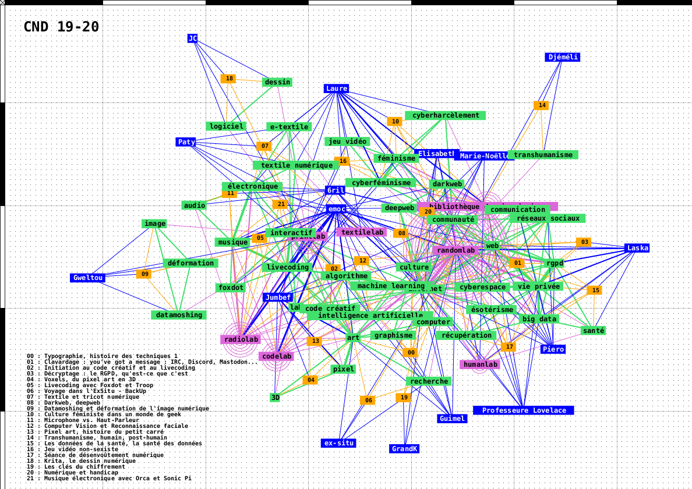
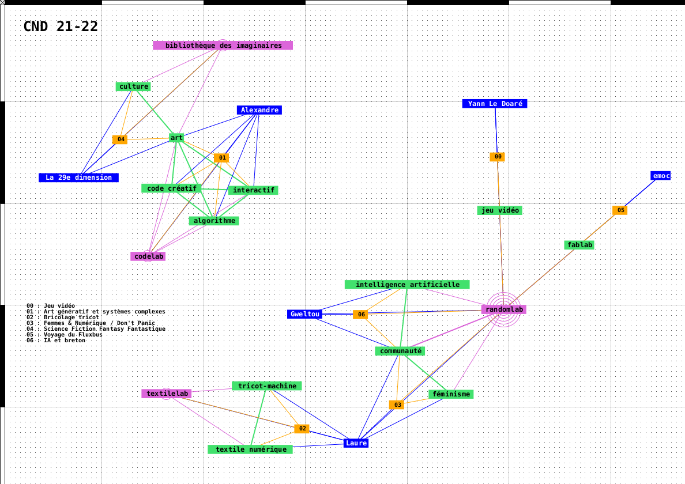
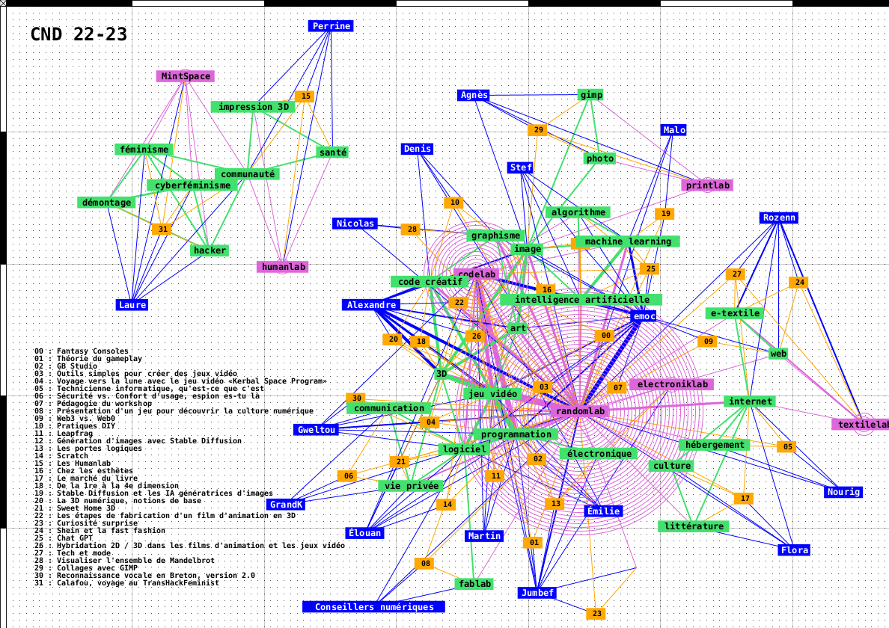

# Cartographie des Curiosités Numériques Digestes

À la fois table des matières et visualisation d'après les données des curiosités numériques digestes proposées par l'association depuis 2018. À chaque saison (de septembre à juin), correspond une carte en 40 x 60 reprenant tous les sujets abordés, leurs auteur·ice·s en y associant des mot-clés et les liens avec les différents labs de l'association.

La cartographie au verso met en lien ces données. Elle est réalisée à partir d'un programme processing, en une version écran interactive et des exports SVG ou PNG. 

Quelques exemples

Cartographie (version écran) pour 2019-2020

Cartographie (version écran) pour 2021-2022

Cartographie (version écran) pour 2022-2023

  
## Préparation des fichiers

40 x 60 cm @ 300dpi : 4724 x 7086 px

Export PNG réalisé avec inkscape v0.92 en ligne de commande, sur Debian 9

inkscape -z -w 7086 -h 4724 graphe_011_CND_22-23.svg -e CND_22-23_verso.png

-z : without GUI
-w : largeur en pixels
-h : hauteur en pixels
-e : export PNG

Pour la documentation de l'utilisation d'inkscape en ligne de commande, voir https://inkscape.org/doc/inkscape-man.html ou utiliser ''man inkscape'' dans un terminal 

Puis montage en pdf avec imagemagick

convert ./CND_22-23_recto.png ./CND_22-23_verso.png -density 300 -units pixelsperinch CND_22-23.pdf